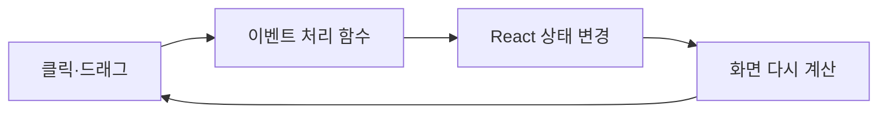

# Python 사용자를 위한 코드 가이드

이 문서는 Python은 다뤄봤지만 웹 개발은 익숙하지 않은 사람이 현재 코드를 직접 읽고 조금씩 고칠 수 있도록 쓴 안내서다.

## 1. 이 프로그램은 어떻게 실행되는가

Python 프로그램은 보통 위에서 아래로 실행되는 스크립트나, 호출을 기다리는 함수들의 모음으로 생각할 수 있다. React 프로그램은 조금 다르다.

React에서는 현재 상태를 바탕으로 화면을 그리는 큰 함수가 있고, 사용자가 클릭하거나 드래그하면 상태가 바뀐다. 상태가 바뀌면 React가 화면을 다시 계산한다.

이 프로젝트의 중심은 다음 함수다.

```tsx
export default function Home() {
  // 상태 선언
  // 게임 규칙 함수
  // 화면을 반환
}
```

Python식으로 비유하면 다음 반복을 프레임워크가 대신 수행한다고 생각하면 된다.

```python
while True:
    event = wait_for_user_input()
    state = update_state(state, event)
    screen = render(state)
```

실제 React 코드는 무한 반복문을 직접 쓰지 않는다. 클릭이나 드래그 이벤트가 올 때만 상태 변경 함수를 호출한다.

## 2. 먼저 알아둘 TypeScript 문법

### `type`: 데이터의 모양

```ts
type EnemyAction = {
  name: string;
  attacks: EnemyHit[];
  strengthGain?: number;
};
```

Python의 `dataclass` 또는 타입이 붙은 딕셔너리와 비슷하다.

```python
@dataclass
class EnemyAction:
    name: str
    attacks: list
    strength_gain: int | None = None
```

TypeScript의 타입은 프로그램을 실행할 때 사라진다. 코드를 쓰는 동안 잘못된 값을 미리 잡는 도구다.

### `const`와 `let`

- `const`: 변수 이름에 다른 값을 다시 대입하지 않겠다는 뜻
- `let`: 나중에 다른 값을 대입할 수 있음

객체나 배열을 `const`로 선언해도 그 내부까지 항상 불변이라는 뜻은 아니다. React 상태에서는 내부를 직접 바꾸기보다 새 객체를 만드는 방식을 주로 쓴다.

### 배열 함수

```ts
const living = enemies.filter((enemy) => enemy.hp > 0);
const names = enemies.map((enemy) => enemy.name);
```

Python으로는 다음과 비슷하다.

```python
living = [enemy for enemy in enemies if enemy.hp > 0]
names = [enemy.name for enemy in enemies]
```

### 펼치기 문법 `...`

```ts
const damaged = { ...enemy, hp: enemy.hp - 5 };
```

기존 `enemy`의 내용을 복사하고 `hp`만 바꾼 새 객체를 만든다. Python의 다음 코드와 비슷하다.

```python
damaged = {**enemy, "hp": enemy["hp"] - 5}
```

### JSX

```tsx
<button onClick={openDeckEditor}>덱 편집</button>
```

HTML처럼 보이지만 TypeScript 안에서 화면 구조를 표현하는 JSX 문법이다. `{...}` 안에는 JavaScript 표현식이 들어간다.

## 3. React 상태 이해하기

```ts
const [screen, setScreen] = useState<Screen>("map");
```

- `screen`: 현재 값
- `setScreen`: 값을 바꾸는 함수
- `"map"`: 초기값

예를 들어 `setScreen("battle")`을 호출하면 React가 화면을 다시 계산해 전투 화면을 보여준다.

주의할 점은 상태를 직접 바꾸면 안 된다는 것이다.

```ts
// 좋지 않음
game.energy = 2;

// 권장
setGame((current) => ({ ...current, energy: 2 }));
```

뒤의 코드는 “현재 상태를 받고, energy만 2인 새 상태를 반환한다”는 뜻이다.

## 4. 파일 지도

### 실제 게임에서 중요한 파일

| 파일 | 역할 |
|---|---|
| `app/page.tsx` | 지도, 전투, 카드, 덱 편집, 상점 등 거의 모든 게임 로직과 화면 |
| `app/game/enemies.ts` | 적 목록, 전투 조합, 다음 행동 선택, 특수 방어 규칙 |
| `app/game/mapEnemies.ts` | 오버맵 적 생성, 상태 변화, L∞ 거리, 8방향 이동 |
| `app/globals.css` | 카드 크기, 색, 배치, 애니메이션, 지도와 팝업 디자인 |
| `app/layout.tsx` | 문서 제목과 전체 HTML 틀 |
| `tests/rendered-html.test.mjs` | 첫 화면이 서버에서 정상 렌더링되는지 검사 |
| `tests/enemies.test.mjs` | 적 체력, 단단함, 재빠름 같은 전투 규칙 검사 |
| `tests/map-enemies.test.mjs` | 9×9 활성화, 상태 변화, 추적과 충돌 검사 |
| `package.json` | 설치할 라이브러리와 실행 명령 |
| `next.config.ts` | GitHub Pages 경로와 정적 빌드 설정 |
| `.github/workflows/deploy-pages.yml` | GitHub에 push했을 때 자동 배포하는 절차 |

### 지금은 건드리지 않아도 되는 파일

- `db/`, `drizzle/`: 데이터베이스용 골격이지만 현재 게임은 사용하지 않는다.
- `examples/`: 데이터베이스 예제다.
- `worker/`: Vinext 빌드 실행 진입점이다.
- `.next/`, `dist/`, `out/`: 빌드 결과물이다. 직접 편집하지 않는다.
- `node_modules/`: 설치된 외부 라이브러리다. 직접 편집하지 않는다.

## 5. `app/page.tsx`를 읽는 순서

3천 줄이 넘으므로 처음부터 끝까지 읽는 것은 비효율적이다.

1. 맨 위의 `type` 선언을 읽어 게임 데이터 모양을 파악한다.
2. `BASIC_CARD_POOL`, `SPECIAL_CARD_POOL`, `RARE_CARD_POOL`에서 카드 목록을 본다.
3. `app/game/enemies.ts`에서 현재 적과 행동 목록을 본다.
4. `app/game/mapEnemies.ts`에서 지도 위 적의 상태와 이동 규칙을 본다.
5. `createDeck()`과 `createRandomDeck()`에서 시작 덱과 드랍 덱 규칙을 본다.
6. `Home()` 안의 `useState` 목록에서 저장되는 상태를 본다.
7. `moveOnMap()`에서 플레이어 이동, 적 이동, 충돌 순서를 본다.
8. `playCard()`와 `endTurn()`에서 전투 계산을 본다.
9. 마지막의 `return (...)`에서 지도/전투 UI를 본다.

VS Code 검색에서 함수 이름이나 카드 이름을 검색하면 빠르다.

## 6. 게임 데이터가 흐르는 방식



예를 들어 공격 카드 사용은 대략 다음과 같다.

1. 카드 드래그를 시작한다.
2. 적 또는 유효한 전투 영역 위에 놓는다.
3. `playCard(card, targetEnemyId)`가 호출된다.
4. 에너지가 충분한지 검사한다.
5. 적 체력, 방어, 손패, 버린 카드 더미 상태를 새로 계산한다.
6. React가 바뀐 체력과 손패를 화면에 반영한다.

## 7. CSS는 무엇을 하는가

`app/globals.css`는 화면의 모양과 움직임을 담당한다.

```css
.card {
  width: 100px;
  height: 142px;
}
```

이런 코드는 `.card`라는 클래스가 붙은 모든 요소의 크기를 정한다. TypeScript에서 다음처럼 연결된다.

```tsx
<article className="card">...</article>
```

UI가 잘리거나 겹치면 먼저 브라우저 개발자 도구에서 해당 요소의 클래스 이름을 찾고, CSS에서 그 클래스를 검색한다.

## 8. 직접 실행하고 확인하는 법

처음 한 번:

```powershell
npm install
```

개발 서버 실행:

```powershell
npm run dev
```

브라우저에서 `http://localhost:3000`을 연다. 개발 서버가 실행 중인 동안 코드를 저장하면 대개 자동으로 다시 반영된다.

검사:

```powershell
npm run lint
npm test
$env:GITHUB_ACTIONS='true'; npm run build:pages
```

Python의 `pytest`처럼 `npm test`가 테스트 명령이다. 현재는 첫 화면 렌더링 외에도 전투 적과 오버맵 적의 핵심 규칙을 검사한다.

## 9. Git과 GitHub의 역할

- Git: 컴퓨터 안에서 코드 변경 이력을 저장한다.
- GitHub: Git 저장소를 인터넷에 보관하고 공유한다.
- commit: 한 덩어리 변경에 이름을 붙여 저장
- push: 로컬 commit을 GitHub로 전송
- GitHub Actions: push를 감지해 빌드와 배포 실행

이 저장소는 `main` 브랜치가 GitHub Pages에 연결되어 있다. 따라서 정상적으로 push되고 Actions가 성공하면 공개 게임 주소가 갱신된다.

## 10. 처음 손대기 좋은 변경

난도가 낮은 순서는 다음과 같다.

1. 카드나 적의 숫자 변경
2. 카드 이름과 설명 변경
3. CSS의 색, 간격, 글자 크기 변경
4. 카드 또는 적 데이터 한 종류 추가
5. 기존 효과를 조합한 카드 추가
6. 완전히 새로운 전투 규칙 추가
7. 저장 기능이나 온라인 기능 추가

숫자를 바꿀 때는 화면 설명만 바꾸지 말고 실제 계산도 함께 검색해야 한다. 예를 들어 카드 설명은 `CardFace()`에 있고 실제 효과는 `playCard()`에 있을 수 있다.

## 11. 현재 코드에서 특히 조심할 점

- 한 기능의 데이터, 실제 계산, 표시 문구가 서로 다른 위치에 있을 수 있다.
- 카드의 `damageType`은 이름과 달리 공격 속성이라기보다 방어 종류를 구분하는 데도 사용된다.
- React 상태 업데이트는 비동기적으로 처리될 수 있다. 오래된 상태를 참조하지 않도록 `setState(current => ...)` 형태를 선호한다.
- 드래그는 마우스 좌표, DOM 요소, React 상태가 함께 움직이므로 작은 변경도 직접 브라우저에서 시험해야 한다.
- `Math.random()`을 사용하는 보상과 덱은 테스트 재현이 어렵다.
- 영구 저장이 없으므로 디버깅 중 새로고침하면 현재 런이 사라진다.

## 12. 앞으로 구조를 개선한다면

당장 전체를 다시 쓸 필요는 없다. 새 적 시스템부터 다음처럼 조금씩 분리하는 것이 좋다.

```text
app/
  game/
    cards.ts       카드 데이터
    enemies.ts     적 데이터와 생성 규칙
    combat.ts      피해·방어·턴 계산
    mapEnemies.ts  지도 위 적의 상태와 이동
    map.ts         지도 칸 생성과 포탈 규칙
  components/
    Card.tsx
    BattleView.tsx
    MapView.tsx
```

수학적으로 보면 지금의 `page.tsx`는 여러 종류의 상태 전이 함수가 한 공간에 섞인 상태다. 기능별로 분리하면 각 부분을 “입력 상태 → 출력 상태”인 함수로 시험하기 쉬워진다.

