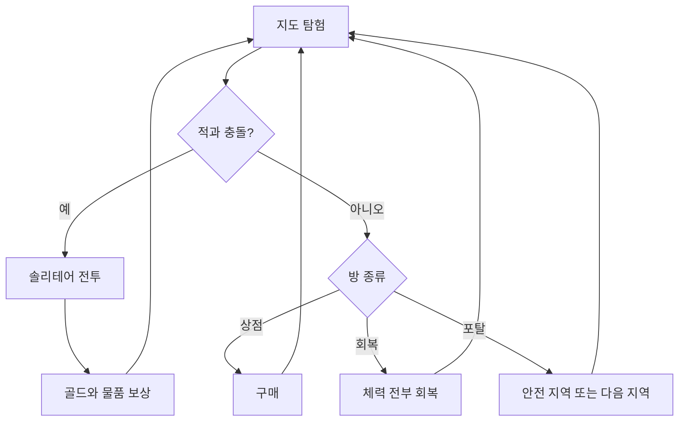

# 현재 게임 규칙

이 문서는 과거 대화 전체가 아니라 **현재 코드에 실제로 구현된 규칙**을 기준으로 한다.

## 1. 게임의 큰 흐름

플레이어는 지도를 이동하고, 전투에서는 카드 파일을 조작해 싸우며, 획득한 카드와 덱 케이스로 덱을 바꾼다.

## 2. 지도

- 총 7개 지역을 미리 생성한다.
- 1지역은 세로 10칸, 2지역은 20칸, …, 7지역은 70칸이다.
- 지역 사이에는 단단한 바위 5줄이 있다.
- 플레이어와 적은 상하좌우와 대각선을 포함한 8방향으로 한 칸씩 이동한다.
- 플레이어 중심의 가로 5칸 × 세로 3칸, 총 15칸 안에서만 적의 위치와 상태를 실시간으로 표시한다. 이미 방문한 길 주변도 지도에 남지만, 시야 밖의 칸은 옅은 회색으로 표시되고 적 정보는 보이지 않는다.
- 카메라는 자유롭게 드래그할 수 있고, 휠 확대/축소에는 최솟값과 최댓값이 있다.
- 한 번 이동할 때 플레이어가 먼저 움직이고, 그다음 적들이 한 번씩 행동한다.
- 적 활성 범위는 플레이어가 움직이기 전 위치를 중심으로 한 9×9 정사각형이다.
- 지나온 길을 클릭하면 자동으로 한 칸씩 이동한다. 이동 도중 적이 15칸 시야에 들어오면 즉시 멈춘다.

### 일반 지역 노드 확률

| 종류 | 확률 | 미리 보임 |
|---|---:|---|
| 상점 | 0.5% | 예 |
| 빈칸 | 나머지 | 예 |

기존 `?`와 칸 자체의 전투 속성은 삭제되었다. 각 지역의 마지막 줄에서는 포탈 확률 5%가 추가되며, 포탈이 하나도 생성되지 않으면 진행을 위해 하나를 보장한다.

### 오버맵 적

- 새 탐험을 시작할 때 전체 지도 빈칸의 적 배치를 8% 확률로 미리 확정한다. 이후 이동해도 새 적은 생성되지 않는다. 최초 시작 칸과 그 주변 8칸에는 적이 생성되지 않는다.
- 적은 처음에 `Zzz` 상태로 생성된다.
- 적과 플레이어 사이의 거리는 `max(|가로 차이|, |세로 차이|)`인 L∞ 거리다.
- 플레이어가 적의 칸으로 이동하거나 적이 플레이어의 칸으로 이동하면 즉시 전투가 시작된다.
- 적은 상점·회복·포탈 같은 특수 칸에도 이동할 수 있다. 같은 칸에 적이 있으면 전투를 먼저 처리한다.
- 상태가 바뀐 적은 그 행동에서 추가로 움직이지 않는다.

| 상태 | 행동 |
|---|---|
| `Zzz` | 이동하지 않는다. 행동 시작 시 거리가 2면 10%, 1이면 50% 확률로 `?`가 된다. |
| `?` | 행동 시작 시 거리가 2면 10%, 1이면 50% 확률로 `!`가 된다. 그대로라면 50% 정지, 50% 무작위 인접 칸 이동이다. |
| `!` | 거리가 4 이상이면 `?`가 된다. 그렇지 않으면 10% 정지, 90% L∞ 거리가 줄어드는 인접 칸으로 이동한다. |

### 안전 지역

- 던전과 같은 좌표 평면의 멀리 떨어진 곳에 있다.
- 단단한 바위로 둘러싸여 있다.
- 상점, 전체 회복, 다음 지역 포탈이 있다.
- 안전 지역에서는 원래 덱의 카드도 자유롭게 꺼낼 수 있다.

## 3. 플레이어와 덱

- 최대 체력: 30
- 덱 케이스 최대 보유 수: 3
- 시작 덱 케이스 용량: 20
- 시작 카드: 타격 8장, 방어 6장, 마법 방어 2장
- 인벤토리 용량: 카드와 소모품을 합쳐 20

전투에는 현재 선택한 덱 케이스 하나를 사용한다.

## 4. 전투와 솔리테어

### 전투 시작

1. 덱을 섞는다.
2. 앞에서부터 5장씩 파일을 만든다.
3. 각 파일의 맨 위 카드만 앞면으로 만든다.
4. 턴 시작에 비어 있지 않은 각 파일의 맨 위 카드를 한 장씩 손으로 가져온다.

예를 들어 27장이라면 `5, 5, 5, 5, 5, 2`인 6개 파일이 된다.

### 턴

- 기본 에너지는 턴마다 3이다.
- 턴 종료 시 손패를 모두 버린다.
- 적들이 차례로 행동한다.
- 다음 턴에 각 파일 맨 위 카드를 다시 가져온다.
- 모든 파일이 빈 경우에만 턴 시작 시 버린 카드 더미를 섞어 새 파일을 만든다.
- 새로 섞을 때 모든 카드의 앞면 정보도 초기화한다.

### 솔리테어 행동

- 손패 카드를 파일 또는 빈 파일 위에 놓을 수 있다.
- 파일 중간부터 그 위의 카드 전체를 다른 파일로 옮길 수 있다.
- 한 번이라도 파일 맨 위였던 카드는 이후 덮여도 앞면을 유지한다.
- 솔리테어 행동은 별 자원을 사용한다.
- 별은 턴 종료나 턴 시작에 자동 회복되지 않는다.
- 별 2개로 파일 맨 위 카드를 손으로 가져오는 임시 기능은 현재 막혀 있다.

### 피해와 방어

- 플레이어가 주는 공격 피해는 한 종류다.
- 힘 1당 카드의 피해가 1 증가한다.
- 적 공격은 두 종류다.
  - 주황색 공격: 방어로만 막는다.
  - 파란색 공격: 마법 방어로만 막는다.
- 방어와 마법 방어는 다음 턴이 시작될 때 사라진다.
- 적을 클릭하면 록온하며, 다시 클릭하면 해제한다.

### 하수구의 적

- 전투마다 아래 다섯 조합 중 하나가 무작위로 등장한다.
- 행동이 둘 이상인 적은 직전에 사용한 행동을 제외하고 다음 행동을 무작위로 고른다.
- 행동이 하나뿐이면 같은 행동을 반복한다.
- 적의 힘은 그 적이 가하는 각 피해의 수치를 올린다.

| 전투 조합 | 체력 | 행동과 특성 |
|---|---:|---|
| 가고일 석상 | 6 | 피해 6 / 힘 3 / 피해 2×3. `단단함`으로 10 이하인 각 피해를 1로 줄인다. |
| 독성 점액 | 24 | 피해 7 후 다음 공격을 마법 속성으로 바꿈 / 피해 7 |
| 하수구 뱀 | 13 | 피해 6. 매 턴 처음 받는 공격을 무시한다. |
| 청소부 | 35 | 피해 11 / 피해 8 후 힘 3 |
| 하수구 쥐 네 마리 | 각 5 | 각자 피해 3 |

## 5. 카드 목록

### 기본

| 카드 | 비용 | 효과 |
|---|---:|---|
| 타격 | 1 | 피해 6 |
| 방어 | 1 | 방어 5 |
| 마법 방어 | 1 | 마법 방어 5 |

### 특별

| 카드 | 비용 | 효과 |
|---|---:|---|
| 폼멜 타격 | 1 | 피해 6, 원하는 파일에서 1장 드로우 |
| 흘려보내기 | 1 | 방어 5, 원하는 파일에서 1장 드로우 |
| 전투 설계 | 1 | 별 3개 획득 |
| 예비 | 0 | 1장 드로우, 1장 버리기 |
| 걷어내기 | 1 | 선택한 파일 전체를 손으로 가져오기 |
| 자와 컴퍼스 | 1 | 피해 6, 별 1개 획득 |
| 광폭화 | 0 | 에너지 2 획득, 이번 턴 받는 피해 2배 |
| 얼음 방패 | 1 | 마법 방어 8, 별 1개 획득 |
| 철의 파동 | 1 | 피해 5, 방어 5 |
| 물의 파동 | 1 | 피해 5, 마법 방어 5 |
| 무쇠 난동 | 2 | 적 전체 피해 8, 방어 5 |

### 희귀

| 카드 | 비용 | 효과 |
|---|---:|---|
| 강철심장 | 1 | 이번 턴 방어와 마법 방어 획득량 3배 |
| 초월 | 4 | 이번 턴 피해 면역, 힘 5 획득 |
| 연사 | 1 | 다음 공격 카드가 한 번 더 발동 |

참고: `예비`는 과거 기획에서 2장으로 상향하자는 말이 있었지만 현재 실제 코드는 1장/1장이다.

## 6. 덱 편집

- 바닥과 인벤토리에 있던 카드는 덱에 자유롭게 넣을 수 있다.
- 일반 지역에서는 편집 전에 원래 덱에 있던 카드를 인벤토리로 바로 꺼낼 수 없다.
- 원래 덱 카드는 휴지통으로 보내 제거할 수 있고, 편집 확정 전에는 되돌릴 수 있다.
- 이번 편집 중 새로 넣은 `NEW!` 카드는 확정 전까지 인벤토리와 바닥으로 다시 옮길 수 있다.
- 안전 지역에서는 원래 덱 카드도 자유롭게 꺼낼 수 있다.
- 취소는 편집 전 상태를 복구한다.
- 인벤토리 용량을 넘긴 상태에서는 편집을 확정할 수 없다.
- 덱 케이스는 바닥과 보유 슬롯 사이에서 드래그할 수 있다.

## 7. 보상과 드랍

전투 승리 시 지역 번호가 `n`이면 골드는 `1`부터 `n` 사이에서 나온다.

추가 물품은 한 종류가 드랍된다.

| 종류 | 장기 목표 비율 |
|---|---:|
| 카드 | 1/2 |
| 소모품 | 1/3 |
| 덱 케이스 | 1/6 |

고정된 6개 주머니를 쓰지 않는다. 각 종류에 누적 부채를 기록하고, 오래 나오지 않은 종류의 가중치를 `exp(0.12 × 부채)`로 조금 올린다. 따라서 짧은 구간은 무작위지만 장기적으로 목표 비율 쪽으로 되돌아간다.

### 카드 보상

- 특별 카드와 희귀 카드 중 하나
- 특별 카드 가중치 1
- 희귀 카드 가중치 0.5

### 덱 케이스

지역 `n`에서 덱 티어는 다음처럼 정해진다. 티어라는 단어는 게임 화면에 표시하지 않는다.

| 결과 | 확률 |
|---|---:|
| `n-1` | 25% |
| `n` | 50% |
| `n+1` | 20% |
| `n+2` | 5% |

0티어 용량은 20이고 티어가 1 오를 때마다 용량이 5 증가한다.

각 슬롯의 생성 확률:

| 내용 | 확률 |
|---|---:|
| 빈칸 | 50% |
| 기본 카드 | 25% |
| 특별 카드 | 20% |
| 희귀 카드 | 5% |

## 8. 소모품

- 추출 티켓: 덱 카드 1장을 선택해 인벤토리로 되돌린다.
- 신속 티켓: 전투에서 에너지 1을 소모하고 선택한 파일 맨 위 카드 1장을 드로우한다.
- 소모품은 카드와 인벤토리 공간을 공유한다.

## 9. 상점

- 일반 지역에서 2% 확률로 미리 생성된다.
- 입장하자마자 창을 열지 않고, 우측 하단 행동 버튼으로 연다.
- 현재 상품은 소모품 2개, 특별 카드 2개, 희귀 카드 1개다.

## 10. 삭제된 기획

다음은 과거에 논의되었지만 현재 게임에는 넣지 않기로 한 시스템이다.

- 카드 활성화/비활성화
- 적 열정과 각성
- `발광` 카드
- 물리/마법으로 나뉜 플레이어 공격 피해

다시 도입하려면 새로운 요청과 설계가 필요하다.

